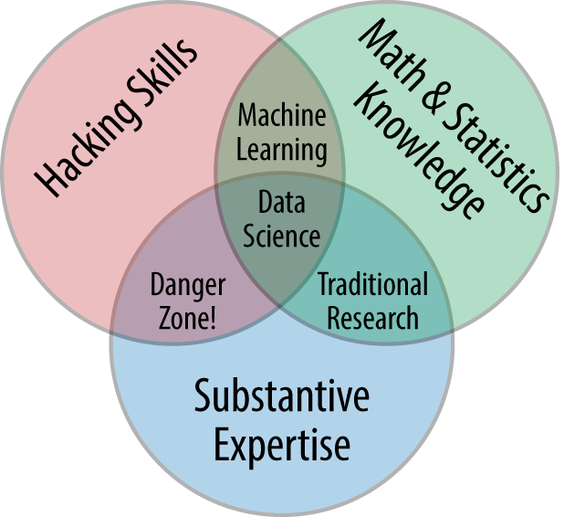

# Welcome to #DataDecember

We know you love data! And we believe you must have a comfortable start in your journey into data science. Say hello to #DataDecember, a 30-day initiative by [LSE’s Data Science Society]([LSESU Data Science Society (dsatlse.github.io)](https://dsatlse.github.io/)) to provide high-quality, beginner-friendly material to pick up data science concepts.

**We value your time as much as we value ours**. That means our resources will not involve articles that lack an important learning point. Also, all the material we provide will be what we have already learnt from and summarised. So, you actually are learning from other learners who are able to identify the exact roadblocks you might hit as beginners. 

**The Philosophy of #DataDecember**  
At the society, we strive to build a community of data science enthusiasts with the help of active, hands-on learning for students at LSE. This December we wish to revisit fundamental theory, infuse it with hands-on resources and explain relevant concepts as how a beginner would like to perceive it. Being a beginner does pose obvious challenges such as being overwhelmed by the sheer expanse of topics to cover, the ever-persistent impostor syndrome, spurious knowledge and confusion induced by online articles. A good way to tackle these challenges could be to start learning together as a community, guided by steps figured out by fellow beginners and experts alike. 

Through #DataDecember, we hope to cultivate a data movement that could help beginners and experts engage with each other and proliferate quality data knowledge.

As Rachel Thomas, co-founder of fast.ai puts it, [“You are best positioned to help people one step behind you”](https://medium.com/@racheltho/why-you-yes-you-should-blog-7d2544ac1045). The #DataDecember is our way of believing in that notion and giving back to the constantly evolving and ever-energetic data science community!

**How to take part in #DataDecember**  
The #DataDecember campaign will be run throughout the month of December. We shall continue to post our content here everyday and also engage through our social media handles. You could make things more interesting by engaging with the hashtag on social media and thus contribute to the nest big social media hashtag of our times!

To take part, all you need to do is follow 3 simple steps:

1. Follow LSE Data Science Society on our social media channels([check here](https://www.canva.com/design/DAEOnf6RnOA/LghQr0ctg-fa3p-A2TO9Ig/view)) if you are not already
2. Keep an eye-out on the daily content releases on this official website maintained by the society
3. Update your daily/weekly progress on social media using the hashtag #DataDecember

**Contributors**  
#DataDecember has been conceived, operationalized and fueled by the data-related interests of some of us at the society. We would love to have a chat with you if you are interested!

```markdown
List of contributors will be up here soon :)
```

## Week 1: Data Science Fundamentals

**Day 1: What is Data Science?**

*Author: Ramshankar Yadhunath*  

> "Data scientists are kind of like the new Renaissance folks, because data science is inherently multidisciplinary" - John Foreman

In this pilot article for #DataDecember, let’s address the elephant in the room – *What is data science?*

First, let’s understand what is meant by “data”. Data is essentially a set of characteristics about a particular observation. This observation could be anything that is uniquely identifiable, for example a person or an organization. Think of it like this – When you watch a movie on an over-the-top (OTT) platform, you essentially are acting as an observation and the genres you like watching could be one of your characteristics.

Now, let’s take the idea a level higher. What if the platform wanted to provide you with recommendations that you would want to see? This is where data science begins to show itself. Data about your watching patterns could be analyzed and used to predict how likely you would be to love a new movie X. Based on this, your recommendation list could be created. Sounds easy enough?

A formal definition of data science that is universally accepted is non-existent. However, most of the definitions out there are closely related. For the sake of simplicity, let’s just think of data science as an *intersection of statistical skills, computing skills and domain knowledge*. While the first two are easy to understand, domain knowledge is not intuitively understood, especially if you are a beginner. Domain knowledge is the knowledge about the kind of data you are working with, including topics such as its origin and the meaning it contributes to the “problem”. The problem refers to the “what you want to achieve” part of your data science project.

**What the beginner thinks**  
Woah! So many articles defining data science in different ways. This is stressful! How do I know what I am learning?

If this sounds like you, don’t worry. This is how every beginner sounds like. Do not bother too much about the definition, unless clear definitions are indispensable parts of what you do. In the simplest sense, think of data science as an endeavour to convert data to value.

**References**  
1. [Science and data science - PNAS](https://www.pnas.org/content/114/33/8689)
2. [The Data Science Venn Diagram - Drew Conway](http://drewconway.com/zia/2013/3/26/the-data-science-venn-diagram)
3. [Is Data Science A Real Science?. As I hear criticisms about how data… by Ludovic Benistant - Towards Data Science](https://towardsdatascience.com/is-data-science-a-real-science-2920bb2529aa)

**Day 2: The Relevance of Data Science Today**

*Author: Maja Lie*

> "We can only see a short distance ahead, but we can see plenty there that needs to be done" - Alan Turing

The idea of being able to see ahead is a powerful one. Psychologically, humans are not designed to think very long term, so the ability to use data analysis techniques to develop models that can give us some notion of what might occur in the future is extremely useful. That is what data science helps to accomplish. Data science is important because it enables us to take data that is not necessarily interesting on its own and pairs us with tools and methods to transform this data into something insightful. However, not all data science models need to be predictive ones; descriptive models can be useful for identifying why a certain product is not selling as well at a company. 

In today’s world, data science is increasingly relevant as the amount of data companies, websites, and other organisations collect on us is exploding. The rise of the internet has led to the easy and rapid collection of people’s personal data: banking information, geographical location, and even what websites and products you click on. This information can drive important business questions. For example, analysing what products are often bought together at a grocery store might influence your local Tesco to change their store layout. If you think about it, data science changes the world around you everywhere. Next time you’re in a store or shopping online, think about how your information might have been used to design a better experience for you as a customer or how advertisements are catered to you. 

Because of how powerful data science can be in driving insights which, in turn, often drive profits, the demand for data scientists is high. Even a small amount of knowledge on the subject is desirable and attractive to employers! As students, we are in the perfect time to learn these skills for our future, which is why data science has become such a big buzzword. 

**What the beginner thinks**  
Data science is a big, scary buzzword that gets thrown around a lot. What does it actually mean? Do I really need to learn it or is this a trend that is just going to disappear eventually?

As a beginner, I thought all of these things when I first started. The truth is, data science really is important in shaping the world around you. Once I started learning about it, I even noticed it changed how I thought about everyday things. I recommend reading a few articles about real applications to see just how important it truly is. One example is targeted advertising. The next time you go online, take note of what you click on and how advertisements change afterwards. Last week, I bought a Christmas sweater and now my advertisements consist of other Christmas sweaters and clothing. When I was on a health kick, advertisements for different diets and gym clothing were more prevalent. These are small, but important ways in which data science impacts us.

**References**
1. [Why Data Science matters](https://medium.com/sequoia-capital/why-data-science-matters-ee583f785a55)
2. [Using Data Science to Predict Alzheimer’s Risk](https://www.biospace.com/article/ibm-and-pfizer-believe-machine-learning-can-predict-alzheimer-s-risk)
3. [Data Scientist: The Sexiest Job of the 21st Century](https://hbr.org/2012/10/data-scientist-the-sexiest-job-of-the-21st-century)

**Day 3: The Different Components of Data Science**

*Author: Ramshankar Yadhunath*

> "The future belongs to those who learn more skills and combine them in creative ways" - Robert Green

In today’s article, let’s explore the different components of data science. In the pilot article, “What is data science?”, we came across the idea that data science is an intersection of stats, coding and domain knowledge. This idea in fact has been adopted from Drew Conway’s representation of data science - The famous data science venn diagram.


<center>Fig 1. The data science venn diagram<a href="http://drewconway.com/zia/2013/3/26/the-data-science-venn-diagram">(Source)</a></center>

According to this representation, data science is a combination of 
* Hacking skills: This helps manipulate all kinds of data, think algorithmically and use computing resources to deal with large amounts of data
* Math and Statistics Knowledge: The tools required to understand the data and extract meaningful insights from it
* Substantive Expertise: The domain-related knowledge that would help make sense of the insights generated in context to the problem being pursued

Having said that, it is now time to address the limitations of this venn diagram representation. A couple of these are:
* The venn diagram does not take into consideration the necessity of soft skills in data science [(Source)](https://towardsdatascience.com/why-the-data-science-venn-diagram-is-misleading-16751f852063)
* The venn diagram is not an accurate representation of data science in business [(Source)](https://www.linkedin.com/pulse/why-data-science-venn-diagram-wrong-kees-groeneveld/)

If you are interested in further abstractions concerning a definition of data science, [this article](https://www.kdnuggets.com/2016/10/battle-data-science-venn-diagrams.html) could be of help. 

**What the beginner thinks**  
So much to learn! How am I going to come to terms with all these multiple components I need? 

It’s very common to think this way. But the idea must be to not bother too much about such abstractions. In practice, you essentially only need to know a good deal of statistics, coding ability, domain knowledge and the most important, the drive to deliver value. While the first 2 can be covered through traditional learning, the last 2 will require you to be driven and passionate about the work you are doing. 

**References**
1. [The Data Science Venn Diagram](https://s3.amazonaws.com/aws.drewconway.com/viz/venn_diagram/data_science.html)
2. [The Essential Data Science Venn Diagram by Andrew Silver - Towards Data Science](https://towardsdatascience.com/the-essential-data-science-venn-diagram-35800c3bef40)

**Day 4: Common Terms You Would Encounter in Your Data Journey**

*Author: Zhen-Yen Chan*

> "Don’t be intimidated by jargon. For example, a model is just a fancy word for 'recipe'." - Cassie Kozyrkov

Here are some common terms you are most likely to encounter in your data science journey! These definitions are written for beginners who have little previous exposure to the world of statistics and programming. 

***Fundamentals***  

***Algorithm:*** A set of instructions we give a computer so it can turn a given set of inputs into corresponding outputs.  
***Data Mining / Data Analytics:*** The process of extracting insights from data and putting it to good use. This includes everything from cleaning and organising the data; to analysing it to find meaningful patterns and connections; to communicating those connections in a way that helps decision-makers improve their product or organisation.  
***Machine Learning:*** The process where a system learns from a set of data by studying patterns between inputs and outputs in that data, and then applies those patterns to make predictions with new input data.  
***Dataset:*** A collection of data that is used in a particular data science initiative.  
***Data Science Model:*** A structure and corresponding interpretation that summarises a set of data, for description or prediction.  

***Data Science Tools***  

***R:*** A programming language for statistical computing that is widely used for statistical modelling and data analysis  
***Python:*** A general-purpose programming language that can also be used for data science and machine learning  
***SQL:*** A programming language used to update and retrieve data from a database  
***GitHub:*** A code-sharing and publishing service, and community for developers which provides collaboration features for programming projects  
***Google Colab:*** A programming notebook tool that allows people to write and execute Python code through the browser, and is especially suitable for data science and machine learning  

***Types of Data***  

***Continuous Data:*** Data that exist as a subset of real numbers, where there is measurable difference between possible values e.g. height, price  
***Categorical Data:*** Data that exist as a finite number of discrete values  
***Time Series:*** A set of data that is ordered by when each data point occurred, for example temperature throughout a day  
***Instance (example, record, observation):*** A single object from the world from which a model will learn from   
***Feature (attribute, field, variable):*** A quantity describing an instance  
***Outcome (label):*** A dependent variable that the model is used to predict  
***Missing Values:*** Values of a feature that are not known or do not exist  

***Statistical Tools***  

***Correlation:*** The measure of how much one set of values depends on another. If values increase together, they are positively correlated. If values from one set increases as the other decreases, they are negatively correlated. There is no correlation when a change in one set has nothing to do with a change in the other.  
***Outlier:*** A data point that is considered extremely far from other points  
***Summary Statistics:*** The measures we use to communicate insights about our data in a simple way. Examples of summary statistics are the mean, median and standard deviation.  

***Machine Learning Techniques***  

***Supervised Learning:*** A type of machine learning used to learn the relationship between independent variables and a specified outcome  
***Regression:*** a supervised learning problem where the outcome is continuous  
***Classification:*** a supervised learning problem where the outcome is categorical  
***Unsupervised Learning:*** A type of machine learning used to group data without a pre-specified outcome  
***Clustering:*** an unsupervised learning problem which attempts to collect and categorise sets of data into groups that are similar to one another   
***Deep Learning:*** A type of machine learning that uses neural networks to solve complex problems, such as natural language processing (analysing text) and computer vision (analysing images)  

***Stages of a Data Science Project***  

***Extract, Transform, Load (ETL, data engineering):*** The process of gathering data from different places in a raw form and changing it into a form that is ready for analysis  
***Data Cleaning / Wrangling:*** The process of manipulating data to make it usable for your project, for example making values consistent with a larger dataset, removing or replacing missing and incorrect values  
***Data Exploration:*** The step where you ask basic questions to understand the context of a dataset, for example by displaying summary statistics and plotting a correlation matrix  
***Data Visualisation:*** The art of communicating meaningful data visually. This can involve infographics, traditional plots, or even interactive dashboards.  
***Feature Engineering:*** The process of translating knowledge we have as humans and translating it into a quantitative value that a computer can understand. For example, we can translate our visual understanding of the image of a mug into a representation of pixel intensities.  
***Training and Testing:*** When building predictive models, you first train the model on training data so that it can build understanding. Then, you test the model on test data where it applies its understanding and makes predictions.  
***Feature Selection:*** The process of identifying which features are the most valuable when building a model.  
***Overfitting:*** Happens when a model considers too much information from its training data that it fails to predict new data reliably  
***Model Deployment:*** Applying the model to real data to form a use case  

**What the beginner thinks**  
It can feel intimidating to have so many new terms to learn! Don’t worry about having to remember or fully understand these definitions right away. Machine learning models are, after all, just “thing labellers''. Learning the meanings of these words will help you get through your first data science book or online course. But more importantly, it’s what you do with this new knowledge that matters. By the end of your first project, you’ll have come across these terms so often that you’ll be able to come up with your own analogies to explain them to other data science beginners. I’ll leave you with one of my favourite videos explaining the [concept of machine learning with the analogy of using a microwave to make pizza](https://www.youtube.com/watch?v=KRvjGYIdJrg). Happy coding, young padawan! 

**References**
1. [Data Science Terms and Jargon: A Glossary](https://www.dataquest.io/blog/data-science-glossary/)
2. [25 Terms Every Data Scientist Should Know](https://blog.coursera.org/ds-academy-25-data-science-terms/)
3. [Glossary of Terms Journal of Machine Learning](http://robotics.stanford.edu/~ronnyk/glossary.html)

**Day 5: Data Science in the Real World**

*Author: Maja Lie*

> "Work gives you meaning and purpose, and life is empty without it" - Stephen Hawking

In today's content, let's dive into where data science is used currently and provide a few examples about the kind of high impact value that this field can deliver. Here are 3 short cases:

***Covid-19***  
Data science was behind many of the public health mandates that have risen out of the Covid-19 crisis; for example, decisions to lock down, wear masks, and social distance were made from analyses done on huge data sets about covid transmission rates and the behaviour of people worldwide. Data science models can allow us to predict how the virus might spread and which areas are most vulnerable. This allows us to prepare PPE ahead of time for these areas so the impact of the virus can be mitigated. The biggest challenge in these analyses is linking the data together in a meaningful way from several different sources.

***London Transport***  
We’ve all been in an overcrowded Tube car during rush hour, but believe it or not, TfL does actively try to use data science to reduce this issue. Data scientists at TfL use ticketing data from entrances and exits at Tube stops to see how people use the transportation network. This data can be used to determine what stops are the most popular, what the busiest times are at each stop, and even how ridership changes due to weather. Using this information, TfL can then use this information to determine how frequent lines run and other design mechanisms to alleviate wait times and overcrowding. 

***Stock Market***  
Lots of things can impact the stock market: news headlines, natural disasters, political atmosphere, etc. Data science is frequently used to do time series analysis about the trend of the stock market over time. In more sophisticated models, we can even predict how stocks will respond to specific news. We can also use classification models in data science to decide if a stock is a good investment or not based on certain criteria(like P/E ratio). 

Now, data science is not limited to a specific dicsipline at all. Remember from day 1 that "domain knowledge" is an integral part of data science? This domain knowledge is nothing but *what you need to know about an area you are going to work on*!

**What the beginner thinks**  
When I was a beginner, I was interested in cryptography, health economics, and education policies. My first thought when I was beginning to learn data science was: how can I apply this to an area of my interest? My recommendation is to think about your interests and how data science might fit into them, then look up a few articles related to it. It might reignite your interest in both the subject and data science!

**References**
1. [OxCovid19 Project](https://covid19.eng.ox.ac.uk/)
2. [How TfL is using data science to reduce station overcrowding and closures](https://diginomica.com/how-tfl-using-data-science-reduce-station-overcrowding-and-closures)
3. [How to Use Data Science on the Stock Market](https://towardsdatascience.com/how-to-use-data-science-on-the-stock-market-9d97a4d348d6)

## Week 2: Statistics and Math

**Day 6: Descriptive Statistics**

*Author: Maja Lie*

> "Factfulness is … recognizing that a single perspective can limit your imagination, and remembering that it is better to look at problems from many angles to get a more accurate understanding and find practical solutions." - Hans Rosling

Descriptive statistics is helpful to understand key features of your data set. It is about describing and summarizing data through important statistics such as mean and variance. When you are carrying out descriptive statistical analyses, it’s important to take note of a few things. The first thing you should look at is the distribution of your data. For example, a lot of data is normally distributed, which is a very popular distribution. This distribution is bell-shaped and symmetric with tails at both ends. Second, you should take note of statistics such as the mean, which is the average, and measures of variability like variance or standard deviation. Measures of variability show us how dispersed our data set is from the mean. Additionally, you can look at graphing your data set to see if there’s any kind of linear relationship or non linear relationship.

Similary, there are many other descriptive analyses you can do, but the important thing is you should do them. Doing this before starting a project can reveal information about your data that might influence the type of model you decide to create or give you an idea of what the most suitable analysis would be. 

**What the beginner thinks**  
*I know what a mean is!* As a beginner, you probably already know quite a bit of descriptive statistics without realising it. A great refresher would be to refamiliarise yourself with the definitions of mean, standard deviation, and the properties of important distributions. Check out ST202 at LSE! Or the internet has endless resources and beginners’ courses that are short and quick. 

**References**
1. [Introduction to Descriptive Statistics](https://towardsdatascience.com/intro-to-descriptive-statistics-and-probability-for-data-science-8effec826488)
2. [Example of Descriptive Statistics from Penn State](https://online.stat.psu.edu/stat505/lesson/1/1.4)

**Day 7: Inferential Statistics - I**

*Author: Shahzeb Khan*

> "There are two kinds of statistics, the kind you look up and the kind you make up." - Rex Stout

Inferential statistics covers how you can use the data you’ve gathered to make predictions about bigger populations which your data doesn’t cover. For example, you’ve carried out a survey in a small village and have gathered figures about the annual income of all the residents. Moreover, you also calculated the average income for all the residents. Great, but can you **infer** anything about the average income of the entire country which the village resides in? Or can you calculate the variance? Inferential statistics equips you with tools to carry out such analysis.

The reason this topic is widely regarded in statistics is because it is often difficult and expensive to gather data on millions of people. So, using inferential statistics, you can carry out your experiment on a small sample of people and use it to estimate how the population in general behaves.

You can see inferential statistics being used just about anywhere you have to carry out analysis of data and so you might even already have some experience of using it. Since it is such an important topic, we’ve decided to split it into two parts. The first part will provide resources that cover statistical probability distributions (these distributions represent the population of your data) and some sampling techniques which are used in collecting data. The second part will talk about estimation techniques, such as the Central Limit Theorem, and confidence intervals.

**What the beginner thinks**  
Wait, I do know a fair bit of this. Then what's holding me back from executing it in a project?

Like with descriptive statistics, even a beginner might already be familiar with some of the topics covered. However, most of the hurdle lies in translating what you’ve learnt into actual executable code. So, it is crucial to know the topic inside and out so that you can easily implement it into a programming language. Even if you already know the topics, it is still a good idea to brush up on some of them. The internet provides vast resources for you to do this, or, if you’re really interested, you can audit the ST102/ST202 courses in LSE.

**References**
1. [Introduction to Inferential Statistics](https://towardsdatascience.com/inferential-statistics-data-analysis-e59adc75c6eb)
2. [Probability Distributions in Python](https://www.datacamp.com/community/tutorials/probability-distributions-python)
3. [Introduction to sampling methods](https://www.scribbr.com/methodology/sampling-methods/)
4. [Using sampling techniques in Python](https://towardsdatascience.com/probability-sampling-with-python-8c977ad78664)
